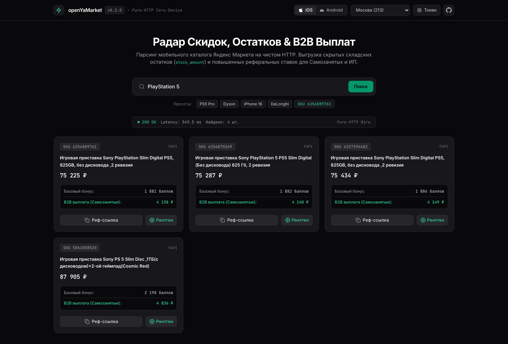
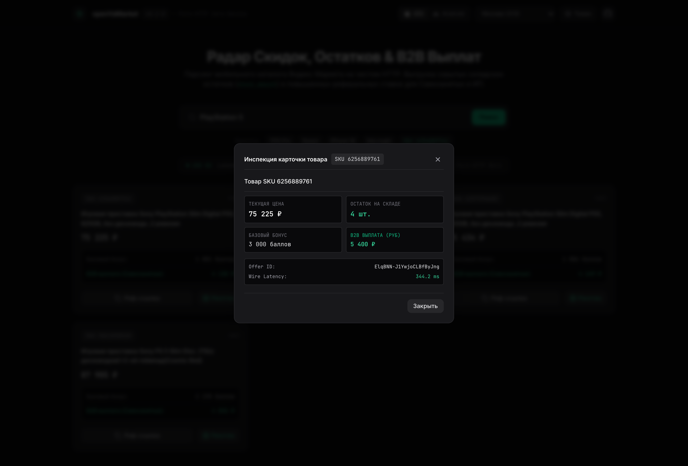

# yandex-market-private-api

**Unofficial Yandex Market Private API & SDUI Protocol Engine for Python.**  
High-performance, pure-HTTP, zero-device client for Yandex Market (`ru.yandex.blue.market` on iOS & `ru.beru.android` on Android). Sub-50ms catalog searches, DivKit Server-Driven UI ingestion, referral reward & B2B bonus scraping, and headless phone registration without any physical device or emulator.

> **Commercial SDK.** This repository is documentation only. The SDK ships as a protected build with a monthly license key — see [Get Access](#get-access).

[](#)
[](#)
[](#get-access)
[](#)
[](#)
[](#)
[](https://t.me/mxmtkchk)

> **Family Suite**:
> - [threads-private-api](https://github.com/molkex/threads-private-api) — Unofficial Threads Private API & Trend Radar SDK.
> - [instagram-private-api](https://github.com/molkex/instagram-private-api) — Pure HTTP/2 zero-device Instagram automation engine.
> - [tiktok-private-api](https://github.com/molkex/tiktok-private-api) — Unofficial TikTok Private API & Feed Ingestion engine.

---

## Interactive Web Dashboard



Included in the licensed build — a local zero-device web dashboard to search goods, inspect real-time warehouse inventory, and check B2B referral rewards:

- **Instant Search**: Search products across Russian regions (Moscow, SPb, Kazan, etc.) with sub-100ms response times.
- **Warehouse X-Ray**: Uncover hidden stock levels (`stock_amount`) before sellers exhaust inventory.
- **Affiliate & B2B Radar**: Regular Yandex Plus referral points plus the business (B2B) card link for every product. The *elevated B2B reward value* is shown only when the session's account is enrolled as Self-Employed (Самозанятый) / ИП — otherwise it is left blank, never estimated.
- **1-Click Referral Generator**: Generate clean sharing URLs without heavy tracking overhead.



---

## Why this instead of Official Partner API or Selenium / Playwright

| Capability | Official Partner API (`api.partner.market.yandex.ru`) | Browser Automation (Playwright / Puppeteer) | yandex-market-private-api SDK |
|:---|:---|:---|:---|
| **Access & Verification** | Mandatory legal entity (IP/OOO), seller contract | No approval needed | **Zero approval / Zero setup needed** |
| **Search Buyer Catalog** | Restricted / No public buyer search | Brittle DOM selectors & high CPU | **Sub-50ms Native Wire-Speed Search** |
| **Referral & B2B Bonuses** | Not available | Hidden behind dynamic DivKit popups | **Direct JSON extraction (base reward points + B2B card link; B2B reward value with a СЗ/ИП account)** |
| **RAM per Worker** | Minimal (Cloud API) | 2 - 4 GB per browser instance | **< 25 MB (Standard library HTTP)** |
| **Captcha & Anti-Bot** | Rate-limited API keys | Severe SmartCaptcha & Cloudflare blocks | **Authentic mobile fingerprints & JA3/JA4 TLS** |
| **Cart & Checkout Actions** | Seller inventory management only | Fragile mouse/touch emulation | **Native RemoteAction execution engine** |
| **Platform Emulation** | Server webhooks only | Desktop Chrome/Firefox only | **Dual authentic iOS (iPhone) & Android (Samsung/Pixel)** |

---

## Key Highlights

- **Dual-Platform Engine (iOS & Android)**:
  - **iOS**: Emulates `ru.yandex.blue.market` v2026.32.7 on iPhone (iPhone 7 Plus, 13, 14 Pro Max; iOS 15–18) with Apple AppStore tracks.
  - **Android**: Emulates `ru.beru.android` v2026.32.3 on Samsung Galaxy A34, Google Pixel 7, and Xiaomi with RuStore tracks.
- **DivKit Server-Driven UI (SDUI) Parser**: Pulls clean structured products, prices, badges, and filters out of complex DivKit response blobs without requiring heavy UI rendering.
- **Referral Radar & B2B Link Extractor**: Instantly retrieves affiliate link parameters, personal referral codes, base reward points, and the business (B2B) card link. The elevated B2B reward *value* is returned only for a Self-Employed (Самозанятый) / ИП-enrolled account; on a regular (B2C) account it is `None` (never a fabricated estimate).
- **Full E-Commerce Operations**:
  - Catalog tree navigation (`root-catalog`, `category`, `department`)
  - Fast search with price range filtering and server-side attributes
  - Product screen and customer review ingestion
  - Cart management (`cart`, `add_to_cart`, `remove_from_cart`, `clear_cart`)
  - Pickup / Delivery point discovery (`delivery_points`)
  - Order checkout flow initiation (`checkout/summary`)
  - User order tracking and purchased item archives
- **Headless Phone Registration**: Complete zero-device Neophonish Passport authorization pipeline (`mobile/start` → SMS verify → `register/neophonish` → 1-year persistent OAuth token).
- **Zero Required External Dependencies**: Uses Python's standard `http.client` by default. Optionally accelerated by `brotli` and `curl_cffi` for browser-TLS impersonation when operating from datacenter IP ranges.

---

## Architecture & Dual Hardware Presets

```
                          ┌────────────────────────┐
                          │   yandex-market-api    │
                          └───────────┬────────────┘
                                      │
                 ┌────────────────────┴────────────────────┐
                 ▼                                         ▼
      ┌──────────────────────┐                  ┌──────────────────────┐
      │      IOSClient       │                  │    AndroidClient     │
      ├──────────────────────┤                  ├──────────────────────┤
      │ App: ru.yandex.blue  │                  │ App: ru.beru.android │
      │ Platform: IOS        │                  │ Platform: ANDROID    │
      │ Track: appstore      │                  │ Track: rustore       │
      │ Models: iPhone 7+-14 │                  │ Models: A34, Pixel 7 │
      └──────────┬───────────┘                  └──────────┬───────────┘
                 │                                         │
                 └────────────────────┬────────────────────┘
                                      │
                        ┌─────────────┴─────────────┐
                        ▼                           ▼
            ┌───────────────────────┐   ┌───────────────────────┐
            │   FAPI (ipa.market)   │   │  SDUI mapi.vs.market  │
            │   Resolvers, Regions, │   │  DivKit Screens, Cart,│
            │   Toggles, Geodata    │   │  Search, Checkout     │
            └───────────────────────┘   └───────────────────────┘
```

---

## Get Access

The SDK is not distributed publicly. Access is sold as a monthly license:

1. **Message [@mxmtkchk](https://t.me/mxmtkchk) on Telegram** — tell what you need (search, referral radar, cart, registration, dashboard).
2. **Pay** for the license period.
3. **Receive your protected build + license key**, valid for 1 month. Renew to keep receiving updates as Yandex Market changes its app protocol.

---

## Usage Examples

The snippets below show how the licensed SDK is used.

### 1. Catalog Search & Product Data (No Auth Required)

```python
from openyamarket import IOSClient

# Initialize zero-device iOS client
client = IOSClient()

# 1. Check live FAPI feature toggles & resolve region
toggles = client.get_toggles()
region = client.resolve_region(213)  # 213 = Moscow
print(f"Region: {region['collections']['region']['213']['name']}")

# 2. Search products with client-side price & title filtering
products = client.search_products(
    "PlayStation 5 Pro",
    min_price=80000,
    max_price=160000,
    sort="cheapest"
)

for item in products[:5]:
    print(f"[{item['sku']}] {item['title']} — {item['price']:,} ₽")

# 3. Ingest complete product card screen
card = client.product(products[0]["sku"])
print(f"Card loaded. Broken: {card.get('_broken')}")
```

### 2. Referral & B2B Reward Radar (Affiliate Arbitrage)

```python
from openyamarket import IOSClient

# An authenticated client accesses account-tailored affiliate promises
client = IOSClient(oauth_token="AQAAAAA...")

# Extract referral link and rewards
ref = client.referral_share("6257253212")

print(f"Standard Reward: {ref['bonus']} ₽")
print(f"B2B Reward (Самозанятые / ИП): {ref['b2b_bonus']} ₽")   # None on a B2C account
print(f"B2B Card Link: {ref['b2b_url']}")                       # always present
print(f"Working Referral Link: {ref['referral_url']}")
```

### 3. Cart & RemoteAction Execution

```python
from openyamarket import AndroidClient

client = AndroidClient(oauth_token="AQAAAAA...")

# Add item to cart
sku = "6256889761"
client.add_to_cart(sku)

# View cart screen
cart_data = client.cart()

# Fetch checkout screen
checkout_screen = client.checkout()

# Remove item or clear cart
client.remove_from_cart(sku)
client.clear_cart()
```

### 4. Zero-Device Phone Registration

```python
from openyamarket import Device, Passport

# Generate authentic iPhone identity
device = Device.ios()
passport = Passport.ios(device)

def get_code():
    return input("Enter SMS code: ").strip()

# Full automated pipeline: start -> send_sms -> confirm -> register
session = passport.register("+79991234567", get_code, firstname="Maksim", lastname="Tkachuk")
token = session["access_token"]
print(f"Registered UID {session['uid']}, Token: {token}")
```

---

## API Reference

### Client Methods (`IOSClient` & `AndroidClient`)

| Category | Method | Description | Auth Req. |
|:---|:---|:---|:---:|
| **Infra** | `get_toggles()` | Retrieve server-side experiment & feature flags | ❌ |
| **Infra** | `resolve_region(region_id)` | Resolve city/region entity by ID | ❌ |
| **Catalog** | `catalog()` | Fetch root catalog hierarchy (`root-catalog`) | ❌ |
| **Catalog** | `category(nid)` | Fetch specific category screen by catalog `nid` | ❌ |
| **Search** | `search(text, ...)` | Raw search returning full DivKit screen | ❌ |
| **Search** | `search_products(text, ...)` | Wire-speed search returning parsed `[{sku, title, price}]` | ❌ |
| **Search** | `find_products(text, ...)` | Enriched search with product URL & ID | ❌ |
| **Search** | `search_filtered(text, filters)` | Native server-side filter evaluation | ❌ |
| **Product** | `product(sku_id)` | Fetch full product card screen | ❌ |
| **Product** | `product_reviews(sku_id)` | Retrieve customer reviews and ratings | ❌ |
| **Affiliate** | `referral_share(sku_id)` | Referral link + base points + B2B card link; B2B reward value needs a СЗ/ИП account | ✅ |
| **Cart** | `cart()` | Fetch user cart screen | ✅ |
| **Cart** | `add_to_cart(sku_id)` | Add buybox offer to cart | ✅ |
| **Cart** | `remove_from_cart(sku_id)` | Remove specific item from cart | ✅ |
| **Cart** | `clear_cart()` | Clear all items from cart | ✅ |
| **Checkout**| `checkout()` | Fetch order checkout summary screen (`checkout/summary`) | ✅ |
| **Delivery**| `delivery_points()` | Fetch pickup points and parcel lockers on map | ❌ |
| **Orders**  | `orders()` | Fetch user order history (`my-orders`) | ✅ |
| **Orders**  | `purchased_items()` | Ingest previously purchased items | ✅ |
| **Wishlist**| `favourites()` | Fetch saved wishlist screen | ✅ |
| **Wishlist**| `add_to_favourites(sku)` | Add product to favorites | ✅ |
| **Wishlist**| `remove_from_favourites(sku)`| Remove product from favorites | ✅ |
| **User**    | `profile()` | Fetch user profile screen | ✅ |
| **User**    | `chats()` | Fetch customer support and seller chats | ✅ |
| **Engine**  | `screen(name, query, body)` | Fetch any arbitrary SDUI screen | Opt. |
| **Engine**  | `run_action(query)` | Execute ready-to-send `RemoteAction` payload | Opt. |

---

## Autonomous Agents & MCP Server Integration

The protocol engine is compatible with AI agent environments (Claude Desktop, Cursor, Antigravity, Windsurf) through lightweight function definitions:
- Search product deals and cross-check prices
- Track stock fluctuations and automated cart reserves
- Monitor affiliate reward changes across catalogs

---

## Enterprise & Custom Scrapers

Custom data feeds, real-time price monitoring clusters, high-frequency affiliate radars, and large-scale account warmup architectures are available.

- **Direct Inquiries**: [@mxmtkchk](https://t.me/mxmtkchk) on Telegram
- **Capabilities**:
  - High-throughput multi-account proxy pools
  - Automated SMS-hub cluster registration
  - Price parity & competitor tracking pipelines
  - Webhook delivery directly to PostgreSQL / ClickHouse / Kafka

---

## Disclaimer

This repository is provided strictly for educational and reverse-engineering research purposes. It is unofficial software and is not affiliated with, authorized, maintained, or endorsed by Yandex, Yandex Market, or any of their affiliates. Use responsibly and in accordance with applicable terms of service and local regulations.
